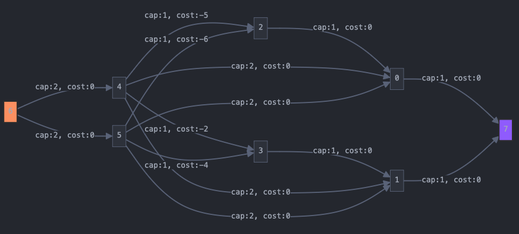

### Solution Concept

This problem can be solved using the BGL max flow min cost algorithm. The challenging part is modeling the problem correctly. In my solution, I connected the source to each bidder with capacity 1. Each property is connected to each state where it is sold with capacity 1 and cost 0. Each state is then connected to the sink, with the capacity being the number of properties that can be sold in this state.

The tricky part is connecting the bidders to the properties. Because we want to minimize the cost to maximize the profit, we could use negative costs. However, this would require using cycle_canceling(), making the algorithm too slow to pass all tests. A faster solution is to set a maximum cost that is higher than every submitted bid and set the cost to max_cost - bid. This allows us to use the successive_shortest_path_nonnegative_weights() algorithm, which is much faster.

There is one last problem we need to address. Since the max flow min cost algorithm optimizes the flow first, it will try to sell as many houses as possible before considering the profit aspect. This is not what we want. Therefore, we add a new edge from each bidder to each state with the maximum possible cost. This way, we simulate that a person does not get to buy any property. Importantly, this also leads to the maximum flow always being the same. Afterward, we only need to find out in the residual network how many people actually bought properties and calculate the actual profit.

This is an example network for the flowing test case with negative weights:\
2 2 2\
1 1\
1 2\
5 2\
6 4\

### Test Results

| Test set | Points | Time limit | Result | Running time |
|----------|---------|------------|---------|--------------|
| 1 | 20 pts | 1 s | Correct | 0.011s |
| 2 | 20 pts | 1 s | Correct | 0.022s |
| 3 | 20 pts | 1 s | Correct | 0.015s |
| 4 | 20 pts | 1 s | Correct | 0.021s |
| 5 | 20 pts | 1 s | Correct | 0.131s |

